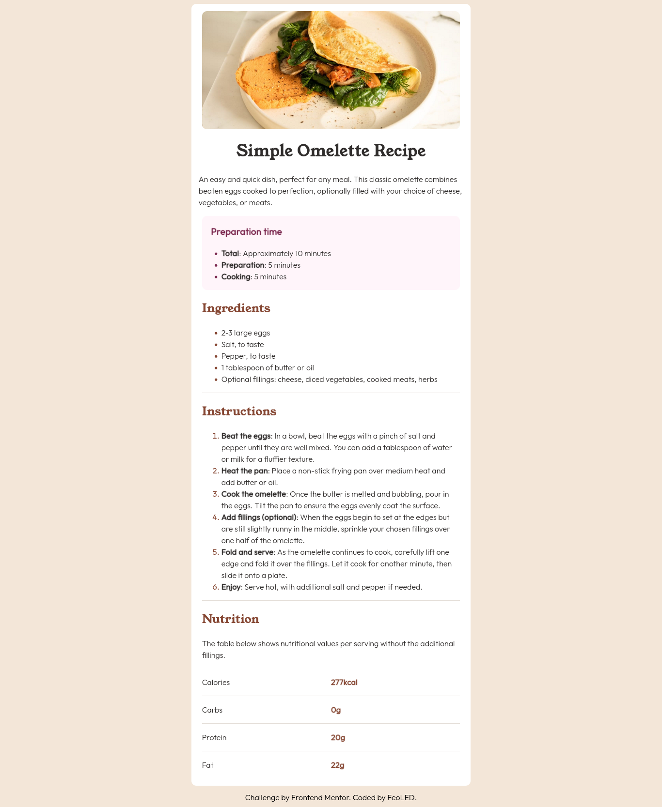

# Frontend Mentor - Recipe page solution

This is a solution to the [Recipe page challenge on Frontend Mentor](https://www.frontendmentor.io/challenges/recipe-page-KiTsR8QQKm). Frontend Mentor challenges help you improve your coding skills by building realistic projects. 

## Table of contents

- [Overview](#overview)
  - [The challenge](#the-challenge)
  - [Screenshot](#screenshot)
  - [Links](#links)
- [My process](#my-process)
  - [Built with](#built-with)
  - [What I learned](#what-i-learned)
  - [Continued development](#continued-development)
  - [Useful resources](#useful-resources)
- [Author](#author)

**Note: Delete this note and update the table of contents based on what sections you keep.**

## Overview

### Screenshot




### Links

- Solution URL: 
- Live Site URL: 

## My process

### Built with

- Semantic HTML5 markup
- Flexbox
- Mobile-first workflow
- Bunny Fonts 


### What I learned

While working on this, I got to experience with the calc() function. A few days prior this project, I learned about various functions from CSS, and I tried to apply
what I learned. I have to say is very convenient for responsive design. For example, on a screen over 900px wide, I applied to the main element:

```css
.main{
    width:calc(1vh*40);
}
```
That way the elements adapt to the screen or navigator window.

Another thing I learned, or more like "revisited" was the position property. While working on the mobile layout, I had to exempt the image (img) element from
the padding from its main parent. I tried different approaches. From changing the width (which worked just a little) to play with negative margins and paddings.
The final solution was to apply position relative to both main and image, then I had to change the image's width so it covered for the main's padding:

```css
.picture{
    width: calc(100% + 2em);
    position: relative;
    border-radius: 0px;
}
```

There are other changes related with the main's width, padding and other elements, focused on the mobile layout. I used @media queries to apply the changes. 


### Continued development

I want to point out how useful is the calc() function, and how cumbersome it was to find the proper "solution" to the "image mobile layout". Even if it worked, I'm not quite 
familiar with positioning. I'll try to apply more of these techniques in the future. 

*(This is a biased opinion but I didn't enjoy solving that situation, positioning right now feels alien and not that good)*

### Useful resources

- [This question at Stack Overflow](https://stackoverflow.com/questions/64665752/how-to-get-image-to-ignore-parent-div-padding) - Here they dicuss the problem with the padding and
  image child element. I toggled mine around until I got the result I wanted so keep in mind playing around to get the hang of it.

## Author

- Website - [FeoLED](https://github.com/FeoLED)
- Frontend Mentor - [@yFeoLED](https://www.frontendmentor.io/profile/FeoLED)
